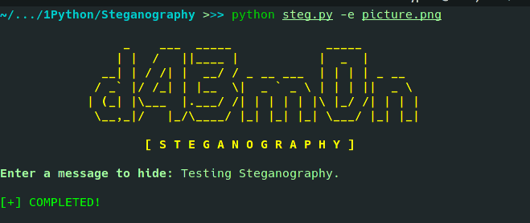
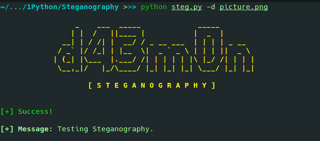

# Steganography

Steganography is the technique of hiding secret data within an ordinary, non-secret, file or message in order to avoid detection;
the secret data is then extracted at its destination. Here, we hide text inside image.

## Install dependencies:

```vim 
pip install -r requirements.txt
```
## Commands: 

### 1. Hiding/Encoding text in image: 
```vim
python steg.py -e <IMAGE PATH>
```


---

### 2. Retriving message from image:
```vim
python steg.py -d <ENCODED IMAGE PATH>
```

